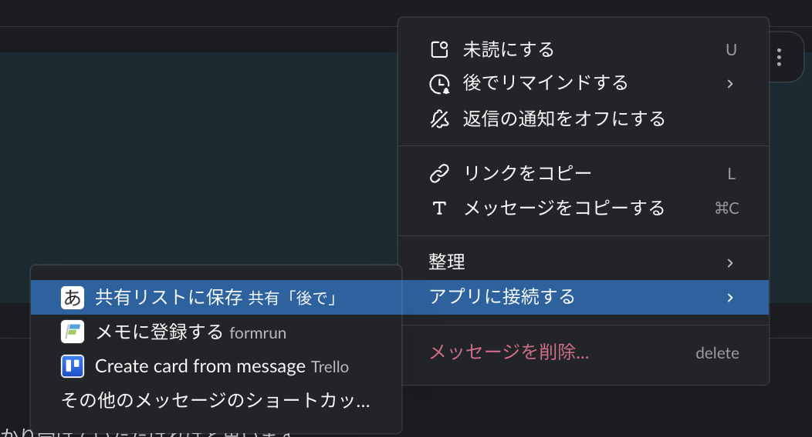

<p align="center">
  
</p>

<h1 align="center">共有「後で」リスト（Slack + SQLite）</h1>

Slack の「後で」(Save for later) には公開 API がないため、**チームで共有できる**タスクリストを
自作したもの。[Bolt for JavaScript](https://slack.dev/bolt-js/) を **Socket Mode** で動かす単一
プロセスのアプリで、状態はローカルの **SQLite** に保存します。公開 URL は不要です。

## 主な機能

- **3 つの登録導線**: グローバルショートカット「後でに追加」/ メッセージショートカット
  「共有リストに保存」/ スラッシュコマンド `/later`
- **共有 App Home**: 誰が開いても同じ共有リスト。各タスク右の **⋯ メニュー**から
  完了 / 編集 / アーカイブ / 進行中に戻す
- **担当者・期限**: 期限切れは 🔴、自分の期限切れは強調表示。期日は相対表記（今日 / 明日 /
  N日後 / N日前）
- **本文のメンション統一**: `/later`・モーダル・メッセージ保存のどの経路でも、本文中の
  `@ユーザー` を本物のメンションとして保存・表示。`@channel` / `@here` などの一斉通知は
  無効化（誤爆防止）。詳細は [docs/architecture.md](docs/architecture.md#本文テキストとメンション)
- **絞り込み（ユーザーごとに保存）**: 状態・期限・担当者・登録者をモーダルで設定
- **非公開チャンネルの保護**: 非公開チャンネル由来のタスクは、担当者・登録者**以外**には
  内容を伏せる（🔒 内容は非表示）。チャンネルミラーでも常にマスク
- **重複検知**: 手入力時、進行中の同一内容＋同一担当者のタスクを弾く
- **任意のチャンネルミラー**: `LIST_CHANNEL` に進行中一覧を 1 メッセージで掲示（閲覧専用、
  操作は Home で）

## スクリーンショット

任意のメッセージの **…** メニューから「共有リストに保存」で、permalink・送信者・チャンネル情報付きで登録できます。



## アーキテクチャ

- **アプリ本体** [`app.js`](app.js): Slack ハンドラ・ビュー生成・チャンネルミラー
- **データ層** [`db.js`](db.js): テーブル定義・マイグレーション・クエリ（`better-sqlite3` 同期 API）
- **構成定義** [`manifest.yaml`](manifest.yaml): スコープ・ショートカット・コマンド

共有性は「同じ DB を全員が見る」ことで担保し、リアルタイム同期はしません（他人の更新は次に
Home を開いた時に反映）。図解付きの詳細は **[docs/architecture.md](docs/architecture.md)** を参照。

## セットアップ

1. <https://api.slack.com/apps> → **Create New App** → **From a manifest** → [`manifest.yaml`](manifest.yaml) を貼る
2. **Basic Information → App-Level Tokens** で scope `connections:write` のトークンを発行（`xapp-…`）
3. ワークスペースに **Install**。**OAuth & Permissions** の Bot Token（`xoxb-…`）を取得
4. `.env.example` を `.env` にコピーし、トークンを記入（チャンネルミラーを使うなら `LIST_CHANNEL` も）
   - ミラー時は対象チャンネルに bot を招待: `/invite @共有「後で」`
5. 依存インストール & 起動:

```bash
npm install
npm start
```

Socket Mode のため公開 URL は不要。`⚡️ 共有「後で」app 起動` が出れば稼働中です。

## 使い方

- アプリの **ホーム**タブ → 共有リスト表示 ＋「＋ 追加」「🔎 絞り込み」
- 任意メッセージの **…** → 「共有リストに保存」（permalink・送信者付きで保存）
- どこでも `/later 牛乳を買う` で即追加、`/later` だけで入力モーダル
- 各タスクの **⋯** → ✅ 完了 / ✏️ 編集 / 🗄 アーカイブ。完了・アーカイブで一覧から消える
  （DB には履歴として残り、絞り込みの「完了済み / アーカイブ済み」で閲覧可）

## 権限（スコープ）

[`manifest.yaml`](manifest.yaml) に定義済み:

| スコープ | 用途 |
| --- | --- |
| `commands` | スラッシュコマンド / ショートカット |
| `chat:write` | チャンネルミラーの投稿・更新 |
| `channels:read` / `groups:read` | 保存元チャンネル（公開 / 非公開）の判定 |
| `im:read` / `mpim:read` | 保存元が DM / グループ DM の場合の判定 |

## 必要環境

- **Node.js 18+**
- `better-sqlite3` のネイティブビルドに Xcode Command Line Tools / build-essential 等が必要な場合あり。
  **実行する Node とビルドした Node のメジャーバージョンを一致**させてください（不一致だと
  `NODE_MODULE_VERSION` エラーになります）。

## ドキュメント

- [アーキテクチャ概要（図解）](docs/architecture.md)

## 拡張案

- リアクション ✅ で完了 → `reaction_added` イベント購読（scope `reactions:read`）
- 期限リマインド（DM 通知）
