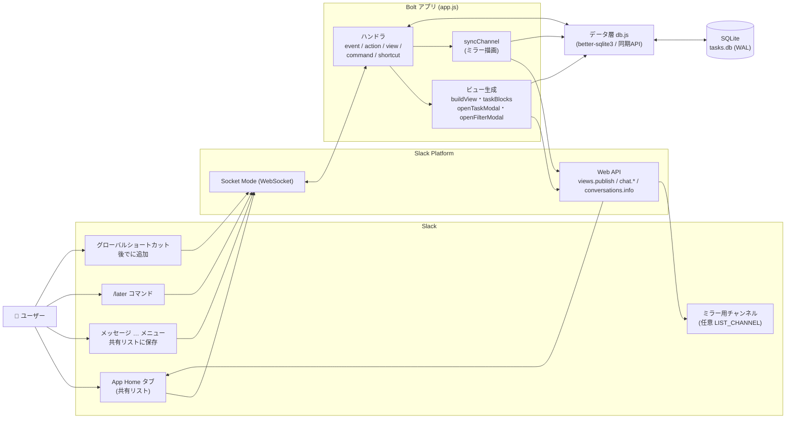
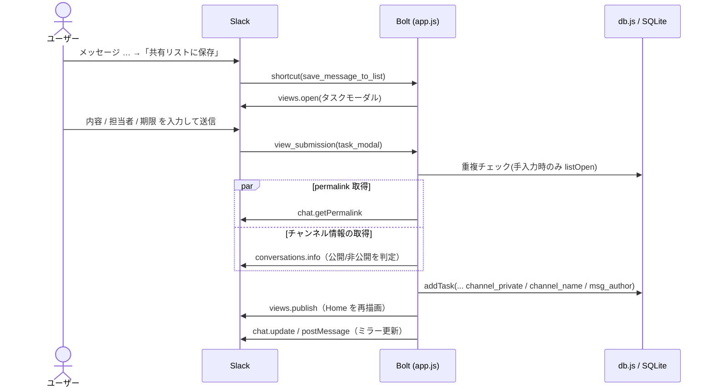
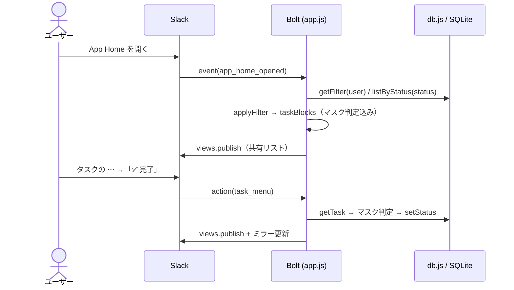
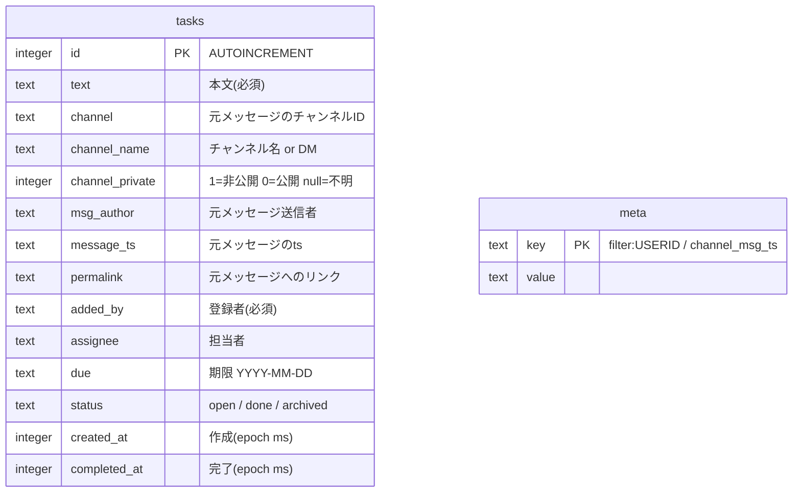
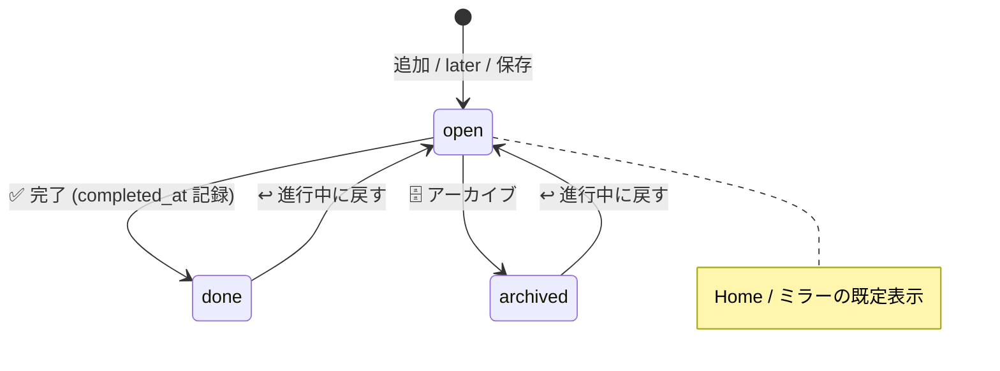
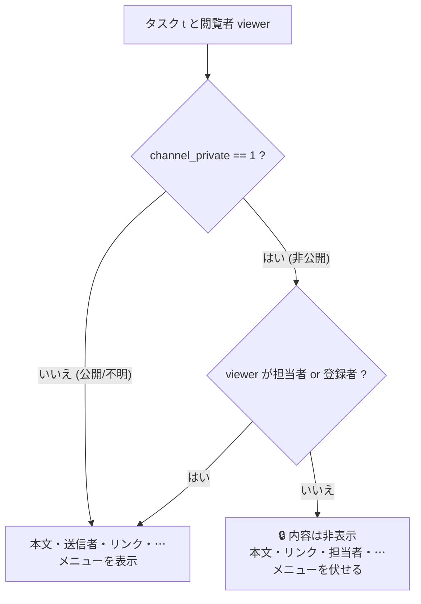
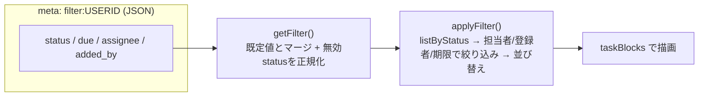
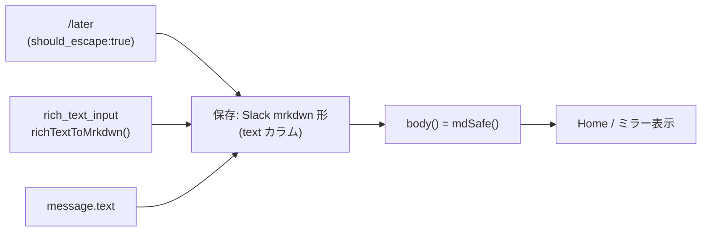

# アーキテクチャ概要

共有「後で」リストは、Slack の [Bolt for JavaScript](https://slack.dev/bolt-js/) を
**Socket Mode** で動かす単一プロセスのアプリです。状態はローカルの **SQLite**
（[better-sqlite3](https://github.com/WiseLibs/better-sqlite3) の同期 API）に保存します。
公開 URL もリクエスト署名の受け口も不要で、`npm start` だけで完結します。

- アプリ本体: [`app.js`](../app.js) … Slack ハンドラ・ビュー生成・チャンネルミラー
- データ層: [`db.js`](../db.js) … テーブル定義・マイグレーション・クエリ
- 構成定義: [`manifest.yaml`](../manifest.yaml) … スコープ・ショートカット・コマンド

---

## 全体構成

ポイント:

- **共有が前提**: タスクは誰のものでもなく 1 つの DB に集約。どのユーザーが Home を開いても
  同じ一覧を見る（フィルター条件だけはユーザーごとに保存）。
- **同期 API**: better-sqlite3 は同期呼び出しのため、クエリは `await` 不要。Slack API 呼び出し
  （`views.publish` 等）だけが非同期。
- **リアルタイムではない**: 他人の更新は「次に Home を開いた時」に反映。常時共有したい場合のみ
  `LIST_CHANNEL` ミラーを使う。

---

## 技術スタック

| 役割 | 採用 |
| --- | --- |
| ランタイム | Node.js（`npm start` = `node app.js`） |
| Slack SDK | `@slack/bolt` v4（Socket Mode） |
| データストア | SQLite（`better-sqlite3`、WAL モード） |
| 設定 | `dotenv`（`.env`） |
| 接続方式 | Socket Mode（公開 URL 不要） |

---

## トリガー（入口）

| 種類 | Slack 上の操作 | 識別子 | ハンドラ |
| --- | --- | --- | --- |
| Event | App Home を開く | `app_home_opened` | Home を再描画 |
| Shortcut（global） | 後でに追加 | `add_task_global` | 入力モーダルを開く |
| Shortcut（message） | メッセージ … →「共有リストに保存」 | `save_message_to_list` | 元メッセージ情報付きでモーダルを開く |
| Command | `/later [内容]` | `/later` | 引数ありで即追加 / なしでモーダル |
| Action | タスクの ⋯ メニュー | `task_menu` | 完了 / 編集 / アーカイブ / 進行中に戻す |
| Action | ＋ 追加 / 🔎 絞り込み ボタン | `open_add_modal` / `open_filter_modal` | 各モーダルを開く |
| View submit | タスク追加・編集 | `task_modal` | 追加 or 更新 → 再描画 |
| View submit | 絞り込み | `filter_modal` | フィルター保存 → 再描画 |

---

## 主要な処理フロー

### 1. メッセージから保存

`getPermalink` と `conversations.info` は互いに独立なので `Promise.allSettled` で並行実行します。
`conversations.info` が `channel_not_found`（bot 未参加の非公開チャンネル）で失敗した場合のみ
「非公開」とみなし、一時的なエラーでは公開チャンネルを誤って隠しません。

### 2. Home の表示と操作

更新系の操作はすべて `refresh()` を通り、Home（操作したユーザー向け）と
任意のチャンネルミラーの両方を更新します。

### 3. チャンネルミラー（任意）

`LIST_CHANNEL` を設定すると、進行中タスクの一覧を 1 つのメッセージとして該当チャンネルに掲示します。

- メッセージ ID（`ts`）は `meta` テーブルの `channel_msg_ts` に保存し、以降は `chat.update` で**同じ
  メッセージを上書き**（新規投稿を増やさない）。
- ミラーは全員に見えるため、`syncChannel` は `viewer = null` で描画し、**非公開チャンネル由来の
  タスクは本文・リンクを常に伏せます**（→ [プライバシー / マスク](#プライバシー--マスク)）。

---

## データモデル

- **マイグレーションは追記式**: 起動時に `PRAGMA table_info` で既存カラムを調べ、不足分だけ
  `ALTER TABLE ... ADD COLUMN` します。`assignee` / `due` / `completed_at` / `channel_name` /
  `channel_private` / `msg_author` は後から追加されたカラムで、既存行では `null` になり得ます。
- **`meta` は汎用 KV**: ユーザーごとのフィルター（`filter:<ユーザーID>` に JSON）と、ミラーメッセージの
  `ts`（`channel_msg_ts`）を保存します。

---

## タスクの状態遷移

`setStatus` は `status='done'` のときだけ `completed_at` に現在時刻を記録し、それ以外（アーカイブ・
進行中に戻す）では `null` に戻します。

---

## プライバシー / マスク

非公開チャンネル（`channel_private = 1`）由来のタスクは、**閲覧者が担当者または登録者のときだけ**
中身を見せ、それ以外には伏せます。判定は単一のヘルパー `canViewPrivate` / `isMasked` に集約し、
Home（`taskBlocks`）・チャンネル名チップ（`channelChip`）・ミラー（`syncChannel`）・操作ハンドラ
（`task_menu`）すべてが同じ基準を共有します。

- **ミラーは常にマスク側**: `syncChannel` は `viewer = null` で呼ぶため、非公開タスクは必ず
  「内容は非表示」になります（チャンネル全員に見えるため）。
- **操作も保護**: `task_menu` ハンドラはサーバ側で `isMasked` を再判定し、見えないタスクへの
  完了 / アーカイブ / 編集を弾きます（古いビューからの操作対策）。
- **チャンネル表示**: 公開は `# 名前`、非公開は `🔒`（閲覧権があれば名前付き）、不明は `📍`。

---

## フィルター

- フィルターは **ユーザーごと**に `meta` へ保存。状態（進行中 / 完了済み / アーカイブ済み）・期限・
  担当者・登録者で絞り込めます。
- `getFilter` は読み出し時に `status` を検証し、旧仕様の `all` など無効値は既定（`open`）へ正規化
  します（一覧が空になる不具合の防止）。
- 並び順は「自分の期限切れ → その他」、各内で期限昇順（なしは末尾）→ 新着順。

---

## 本文テキストとメンション

タスク本文は **3 つの入口すべてで Slack mrkdwn エンコード形**（`<@U…>` などのトークン＋
`&` `<` `>` はエスケープ済み）に正規化して保存し、表示も共通処理を通します。これにより
「`@yamadar` をどの経路で入力しても同じく本物のメンションになる」挙動に統一しています。

| 入口 | 取り込み方法 | 保存形 |
| --- | --- | --- |
| `/later @yamadar …` | スラッシュコマンド（`should_escape: true`）を Slack 側で変換 | `<@U…>` |
| ＋追加 / 編集 モーダル | `rich_text_input` → `richTextToMrkdwn()` で変換 | `<@U…>` |
| メッセージメニュー | `message.text` が元から変換済み | `<@U…>` |

- **表示の安全化（`mdSafe`）**: ユーザー・チャンネル・リンクのメンションはそのまま活かしつつ、
  `@channel` / `@here` / `@everyone`・ユーザーグループは**通知が飛ばないようプレーン化**します
  （チャンネルミラーは実メッセージのため、一斉通知の誤爆を防ぐ）。
- **メンション偽装の防止**: モーダルやスラッシュで**文字として** `<@U…>` と打っても、テキストは
  エスケープされるのでメンションにはなりません。実際の選択（rich_text のユーザー要素 / Slack の
  変換）だけが `<@U…>` になります。
- **編集時のプリフィル**: 保存済み mrkdwn は `mrkdwnToRichText()` で `rich_text_input` の
  `initial_value` に逆変換し、メンションをチップ表示します。
- **移行**: 本仕様より前に手入力された素の `@yamadar` は遡及的にはリンク化されません
  （編集・再入力で本物のメンションになります）。

---

## 主要モジュール / 関数

### `app.js`

| 区分 | 関数 | 役割 |
| --- | --- | --- |
| 整形 | `esc` / `htmlUnesc` / `jdate` / `todayJST` / `clip` / `body` | エスケープ・日時整形・本文整形 |
| メンション | `mdSafe` / `richTextToMrkdwn` / `mrkdwnToRichText` | 表示安全化・rich_text ⇄ mrkdwn 変換 |
| 期限 | `isOverdue` / `dueRelative` / `dueChip` | 期限切れ判定・相対表記・チップ |
| 公開範囲 | `realName` / `canViewPrivate` / `isMasked` / `channelChip` | プレースホルダ除去・マスク判定・表示 |
| フィルター | `getFilter` / `setFilter` / `applyFilter` | 取得・保存・適用 |
| 重複 | `isDuplicateOpen` | 進行中の同一内容＋同一担当者を検知 |
| 描画 | `taskMenu` / `taskBlocks` / `buildView` / `syncChannel` | ⋯メニュー・1件・Home 全体・ミラー |
| モーダル | `openTaskModal` / `openFilterModal` | 追加/編集・絞り込み |
| 起点 | `publish` / `refresh` | Home 描画 / Home＋ミラー更新 |

### `db.js`

| 関数 | 役割 |
| --- | --- |
| `addTask` | タスク追加（全カラム） |
| `getTask` | ID 取得 |
| `updateTask` | 本文・担当者・期限を更新 |
| `listByStatus` | 状態で絞り込み取得 |
| `listOpen` | 進行中のみ（期限昇順） |
| `setStatus` | 状態変更（done のみ completed_at 記録） |
| `getMeta` / `setMeta` | KV の取得 / upsert |

---

## 設計上の注意点・既知の制約

- **リアルタイム同期はしない**: 共有性は「同じ DB を全員が見る」ことで担保。即時反映が要るなら
  `LIST_CHANNEL` ミラー。
- **必要スコープ**: メッセージ保存時の `conversations.info` のため、`channels:read` / `groups:read` /
  `im:read` / `mpim:read` が必要（`manifest.yaml` に定義済み）。
- **単一プロセス前提**: SQLite ローカルファイル + ミラーメッセージ ID を `meta` に保持するため、
  水平スケール（複数インスタンス同時稼働）は想定していません。
- **ネイティブモジュール**: `better-sqlite3` は実行する Node のバージョンに合わせてビルドが必要。
  `npm start` で使う Node と、ビルド時の Node を一致させてください（不一致だと `NODE_MODULE_VERSION`
  エラー）。
